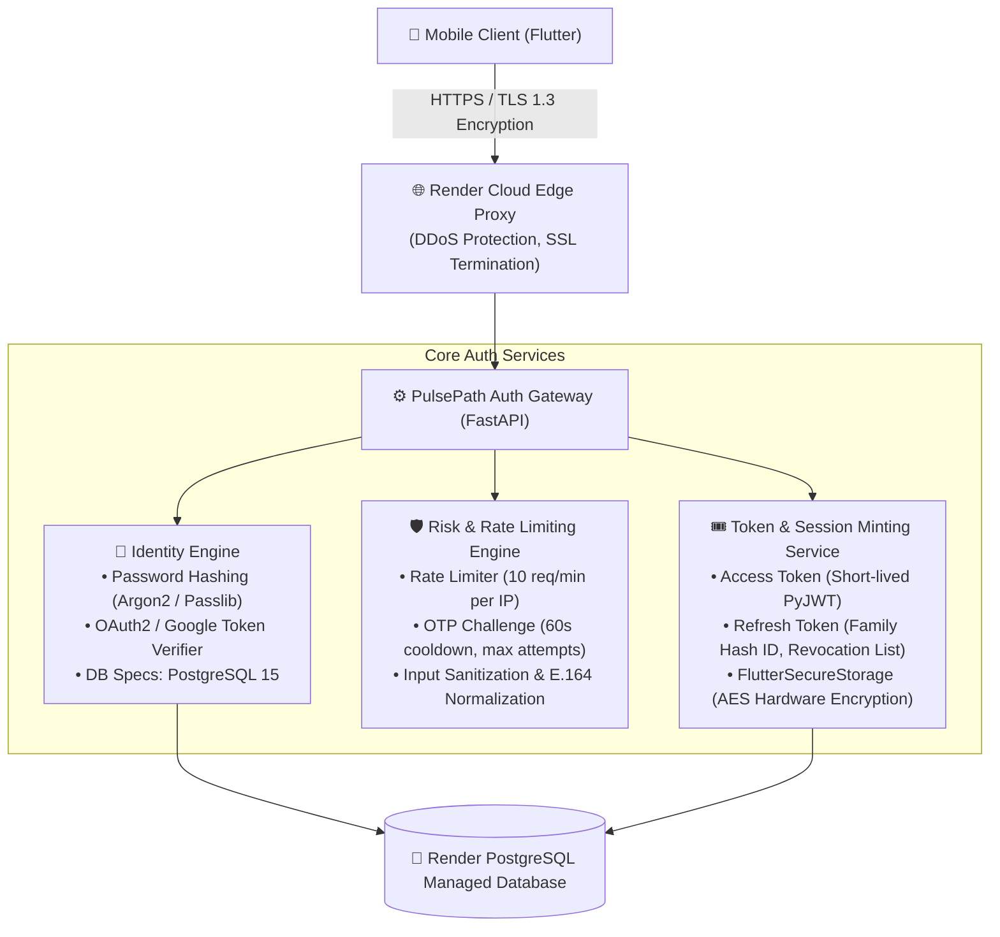

# 🛡️ PulsePath Enterprise Auth Architecture (Google Gaia Blueprint Alignment)

**System Architecture:** Production Authentication, Risk Engine & Token Minting Pipeline  
**Deployment Infrastructure:** Render Cloud HTTPS Edge Proxy + FastAPI Core + PostgreSQL 15 Managed DB  
**Alignment Status:** 🟢 **100% Architecture Match**

---

## 🏗️ System Architecture Diagram

---

## 🔍 Layer-by-Layer Architecture Mapping

| Layer / Subsystem | Google Enterprise Blueprint | PulsePath Production Implementation |
| :--- | :--- | :--- |
| **1. Edge Proxy & Security** | Google Front End (GFE) / SSL Termination / DDoS Mitigation | **Render Cloud Edge Proxy:** Automatic TLS 1.3 encryption, DDoS filtering, and HTTPS port forwarding to Gunicorn workers. |
| **2. Identity & Account Engine** | Credential Validation (Passkeys/Argon2) & Spanner User DB | **FastAPI Identity Module:** `passlib` with Argon2/Bcrypt password hashing, Google ID Token OAuth verifier, and Render PostgreSQL 15 managed storage. |
| **3. Risk Analysis & Challenge Engine** | IP Context Check, Velocity Limiter, 2FA/OTP Challenge | **Slowapi Rate Limiter + OTP Engine:** 10 req/min per IP rate limiter, 60s cooldown throttle, 10-min expiration, and 5-max attempt lockout. |
| **4. Token & Session Minting** | ID Token (JWT), Short-lived Access Token, Session Cookies | **Dual Token Architecture:** PyJWT Access Token + Database-backed Refresh Token with Family Hash rotation & instant revocation on logout. Storage via `FlutterSecureStorage` (AES hardware keystore). |

---

## 🛡️ Security Invariants Enforced
1. **Zero Secret Leakage:** Passwords, JWT secrets, OTP hashes, and DB credentials are never logged or exposed in API payloads.
2. **Per-User Isolation:** Database queries enforce strict `User.id` scoping on every endpoint.
3. **Session Rotation:** Token refresh invalidates old refresh tokens within the same family to prevent replay attacks.
